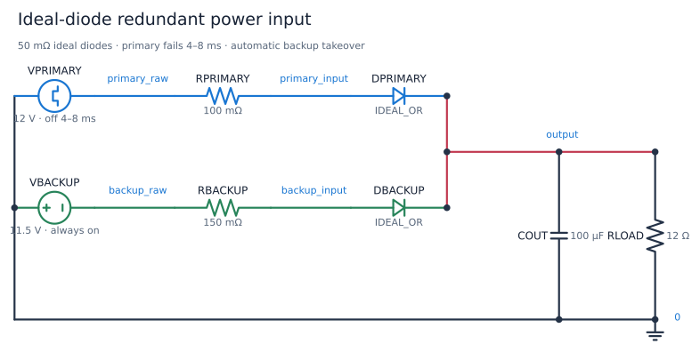
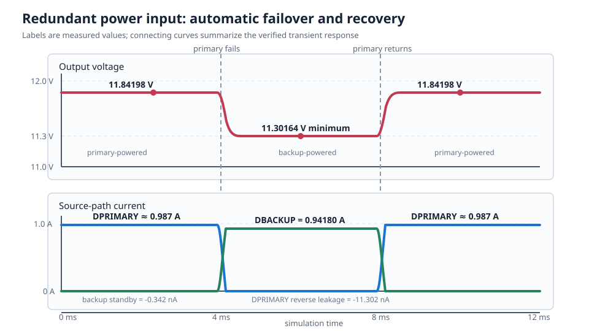

# Ideal-Diode Redundant Power Input

This circuit lets either of two DC supplies power one load without allowing
the active supply to drive current backward into the inactive supply. A 12 V
primary input normally carries the load. When it fails, an 11.5 V backup takes
over automatically; when the primary recovers, the circuit hands the load back.

| Property | Value |
| --- | --- |
| Requires | `SpiceSharpParser.CustomComponents` ideal diode |
| Dialect | LTspice-style ideal-diode `.MODEL` |
| Analysis | TRAN |
| Difficulty | Intermediate |
| Main lesson | Supply OR-ing, failover, and reverse-current blocking |
| Verified with | SpiceSharpParser 3.4.x repository tests |
| Native LTspice cross-check | Ideal-diode family cross-checked; complete application not yet cross-checked |

## Design Targets

| Target | Value |
| --- | ---: |
| Primary supply | 12.0 V |
| Backup supply | 11.5 V |
| Load | 12 ohm |
| Primary source resistance | 100 milliohm |
| Backup source resistance | 150 milliohm |
| OR-ing diode on-resistance | 50 milliohm |
| OR-ing diode forward threshold | 10 mV |
| Output hold-up capacitance | 100 uF |
| Primary failure / recovery | 4 ms / 8 ms |
| Minimum output during failover | Above 11.0 V |
| Inactive-supply reverse current | Below 1 uA magnitude |

## Schematic



The node names match
[ideal-diode-power-or.cir](ideal-diode-power-or.cir). The diode anodes face
the supplies and their cathodes join at `output`. That orientation permits
current from either supply to the load while blocking current from the output
back into a lower or failed supply.

## Runnable Netlist

The essential circuit is:

```spice
VPRIMARY primary_raw 0 PWL(0 12 4m 12 4.01m 0 8m 0 8.01m 12 12m 12)
RPRIMARY primary_raw primary_input 100m

VBACKUP backup_raw 0 11.5
RBACKUP backup_raw backup_input 150m

DPRIMARY primary_input output IDEAL_OR
DBACKUP backup_input output IDEAL_OR
.MODEL IDEAL_OR D(Ron=50m Roff=1G Vfwd=10m)

COUT output 0 100u
RLOAD output 0 12
```

The complete file adds transient analysis, measurements, saved signals, and a
plot request.

## How It Works

Here, “OR-ing” means that either supply can power the output. It is not a
digital OR gate.

### Primary supply available

The 12 V primary produces the higher diode-anode voltage. `DPRIMARY` conducts
and carries approximately 0.987 A. Its output voltage is high enough to
reverse-bias `DBACKUP`, so the backup remains connected but supplies
essentially no current.

### Primary supply fails

At 4 ms, `VPRIMARY` falls to 0 V. `DPRIMARY` turns off and blocks the output
from discharging into the failed source. `COUT` initially supplies the load, so
the output voltage begins to fall rather than disappearing immediately.

As soon as the output falls below the backup input by approximately 10 mV,
`DBACKUP` turns on. The backup then carries approximately 0.942 A and holds the
output near 11.30 V.

### Primary supply recovers

At 8 ms, the primary returns to 12 V. `DPRIMARY` turns on, raises the output
back to approximately 11.84 V, and reverse-biases `DBACKUP` again. No explicit
control signal is needed; the two diode voltages decide which path conducts.

## Design Calculations

When one source is active, its source resistance and diode on-resistance are
in series with the load. For the primary path:

$$
R_{\text{primary path}}=0.10+0.05=0.15\ \Omega
$$

Accounting for the 10 mV diode threshold:

$$
V_{\text{out,primary}}
=(12.0-0.01)\frac{12}{12+0.15}
=11.842\ \text{V}
$$

and:

$$
I_{\text{primary}}
=\frac{11.842}{12}
=0.987\ \text{A}
$$

The backup path has 0.15 ohm of source resistance plus 0.05 ohm of diode
resistance:

$$
V_{\text{out,backup}}
=(11.5-0.01)\frac{12}{12+0.20}
=11.302\ \text{V}
$$

$$
I_{\text{backup}}
=\frac{11.302}{12}
=0.942\ \text{A}
$$

While the backup is active, the failed primary diode sees approximately
-11.3 V. Its 1 Gohm off resistance predicts:

$$
I_{\text{reverse}}
\approx\frac{-11.3}{1\ \text{G}\Omega}
=-11.3\ \text{nA}
$$

The capacitor stores:

$$
E=\frac{1}{2}CV^2
\approx\frac{1}{2}(100\ \text{uF})(11.84\ \text{V})^2
=7.0\ \text{mJ}
$$

In this idealized model, diode switching is immediate, so the failover minimum
is almost the same as the steady backup voltage. Real controllers and power
paths introduce additional delay and voltage drop.

## Simulation Setup

The transient analysis runs for 12 ms with a 1 us maximum timestep:

- 0 to 4 ms: primary active, backup blocked;
- 4 to 8 ms: primary failed, backup active;
- 8 to 12 ms: primary recovered, backup blocked again.

Measurements avoid the switching instants and average steady portions of each
state. The failover minimum separately checks the transition from 3.9 to
4.5 ms.

`.SAVE` and `.PLOT` request the two input nodes, the output bus, and both diode
currents.



## Verified Measurements

| Measurement | Acceptance range | Verified result |
| --- | ---: | ---: |
| Primary-powered output average | 11.75 to 11.90 V | 11.84198 V |
| Backup-powered output average | 11.20 to 11.40 V | 11.30164 V |
| Minimum output during failover | 11.20 to 11.40 V | 11.30164 V |
| Output after primary recovery | 11.75 to 11.90 V | 11.84198 V |
| Backup standby current | -10 to +10 nA | -0.342 nA |
| Backup active current | 0.90 to 0.98 A | 0.94180 A |
| Current into failed primary | -100 to 0 nA | -11.302 nA |

Negative diode current means current is directed from `output` toward that
supply. The two nanoampere-scale negative results demonstrate the finite 1
Gohm off-state leakage, not an unintended conducting path.

## Experiments

- Lower the backup from 11.5 V to 10 V and observe the larger failover step.
- Make both supplies 12 V and compare how the source resistances share current.
- Increase `Ron` to model a higher-loss OR-ing element.
- Reduce `Roff` to see how off-state leakage can back-power a failed rail.
- Remove `COUT` and compare the voltage around the 4 ms handoff.
- Increase `RLOAD` to reduce load current and compare the calculated output
  drop.
- Add a third diode path to model an auxiliary input.

## Model Boundary

This is a behavioral power-path experiment, not a production ideal-diode
controller design. The ideal diode is memoryless and omits MOSFET gate-drive
delay, body-diode conduction, reverse recovery, switching oscillation, current
limit, thermal behavior, safe operating area, and controller quiescent current.

The supplies use fixed series resistances; they do not model wiring
inductance, foldback, battery impedance versus state of charge, connector
bounce, or ground differences. `COUT` has no ESR, ESL, tolerance, or voltage
rating.

Use the circuit to understand source selection and reverse-current blocking.
Use vendor controller models, parasitics, tolerances, and fault analysis before
designing real redundant-power hardware.

## Running and Testing

Enable custom mappings before compilation:

```csharp
using System;
using SpiceSharpParser;
using SpiceSharpParser.CustomComponents;

var options = new SpiceCompileOptions
{
    Dialect = SpiceDialect.LTspice,
    ConfigureReader = settings => settings.UseCustomComponents(),
};

SpiceCompilationResult result =
    SpiceCompiler.CompileFile("ideal-diode-power-or.cir", options);

if (!result.Success)
{
    throw new InvalidOperationException(
        string.Join(Environment.NewLine, result.Diagnostics));
}

foreach (var simulation in result.Model.Simulations)
{
    simulation.Execute(result.Model.Circuit);
}
```

Run its repository regression test:

```powershell
dotnet test src/SpiceSharpParser.Tests/SpiceSharpParser.Tests.csproj `
  --filter 'FullyQualifiedName~CircuitCookbookTests'
```
