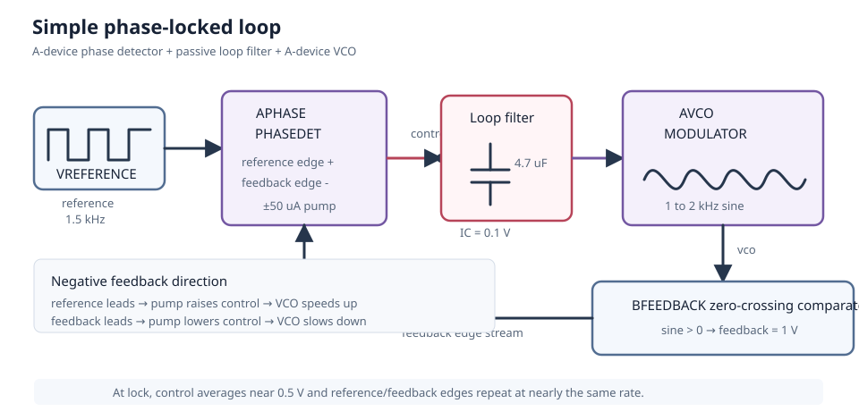
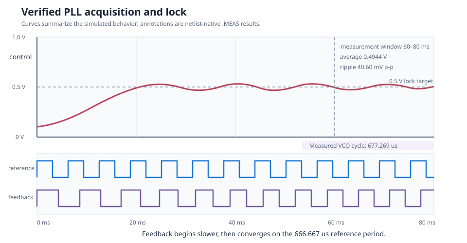

# Simple Phase-Locked Loop

This circuit is a small charge-pump phase-locked loop assembled from existing
LTspice A-device families. It repeatedly compares the arrival time of a
reference edge with an oscillator-feedback edge. The result charges or
discharges a capacitor, and the capacitor voltage speeds up or slows down the
oscillator. The loop starts near 1.1 kHz and acquires a 1.5 kHz reference.

| Property | Value |
| --- | --- |
| Requires | `SpiceSharpParser.CustomComponents` |
| Dialect | LTspice A-device syntax |
| Analyses | TRAN |
| Difficulty | Advanced |
| Components | `PHASEDET` and `MODULATOR` |
| Verified with | SpiceSharpParser 3.4.x repository tests |
| Native LTspice cross-check | Component families cross-checked; complete loop not yet cross-checked |

## What the Phase Detector Does

Two clocks can run at the same frequency but have their rising edges at
different times. That timing difference is their **phase error**.

`PHASEDET` watches the rising edges of `reference` and `feedback`. It remembers
which edge arrived first and drives a fixed current until the other edge
arrives:

| What happens | `PHASEDET` output | Result |
| --- | ---: | --- |
| `reference` rises first | +50 uA until `feedback` rises | Charge `CLOOP`, raise `control`, speed up the VCO |
| `feedback` rises first | -50 uA until `reference` rises | Discharge `CLOOP`, lower `control`, slow down the VCO |
| Edges arrive together | Approximately 0 A | Leave the VCO speed nearly unchanged |

For example, suppose the reference edge arrives 100 us before the feedback
edge:

```text
time ------------------------------------------------------------>

reference       rises here
                    |
                    +---------- 100 us ----------+
                                                |
feedback                                    rises here

PHASEDET       +50 uA during this interval, then 0 A
```

That current changes the capacitor voltage by:

$$
\Delta V=\frac{I\Delta t}{C}
=\frac{50\ \text{uA}\times100\ \text{us}}{4.7\ \text{uF}}
=1.06\ \text{mV}
$$

The VCO sensitivity is 1 kHz/V, so this one correction raises its frequency by
about 1.06 Hz. The detector makes another correction on every cycle. Large
timing errors create long current pulses; small timing errors create short
pulses.

It is called a **phase/frequency detector** because it also corrects frequency.
If the VCO is too slow, reference edges keep arriving first. If it is too fast,
feedback edges keep arriving first.

## Design Targets

| Target | Value |
| --- | ---: |
| Reference frequency | 1.5 kHz |
| VCO tuning range | 1 to 2 kHz for 0 to 1 V |
| Initial control voltage | 0.1 V |
| Initial VCO frequency | About 1.1 kHz |
| Locked control voltage | About 0.5 V |
| Charge-pump current | 50 uA |
| Loop capacitance | 4.7 uF |
| Locked-period error | Below 3 percent |

## Schematic



The node labels match [`simple-pll.cir`](simple-pll.cir). The loop is entirely
closed inside the netlist: `reference` and `feedback` enter `APHASE`;
`control` tunes `AVCO`; and `BFEEDBACK` converts the oscillator sine wave back
into logic-level edges.

## Runnable Netlist

The complete circuit is in [`simple-pll.cir`](simple-pll.cir). The essential
loop is:

```spice
APHASE reference feedback 0 0 0 0 control 0 PHASEDET
+ Iout=50u Vhigh=1 Vlow=0
CLOOP control 0 4.7u IC=0.1
RLOOP_LEAK control 0 10Meg

AVCO control 0 0 0 0 0 vco 0 MODULATOR
+ Mark=2k Space=1k Rout=10

BFEEDBACK feedback 0 V={if(V(vco)>0,1,0)}
```

Both A-device lines have eight terminal positions. Terminal 8 is common. The
unused `MODULATOR` amplitude terminal repeats common, selecting the supported
default sine-wave amplitude of 1 V.

## How It Works

Follow one trip around the loop:

1. `VREFERENCE` produces rising edges at 1.5 kHz.
2. `AVCO` produces a sine wave. It initially runs near 1.1 kHz because
   `CLOOP` starts at 0.1 V.
3. `BFEEDBACK` converts that sine wave to a 0/1 V clock. A rising feedback edge
   occurs whenever the VCO sine wave crosses zero in the positive direction.
4. `APHASE` compares each reference edge with the corresponding feedback edge.
   Because the VCO initially runs too slowly, the reference normally arrives
   first, so `APHASE` supplies positive current.
5. Positive current charges `CLOOP`. Its stored voltage is the `control`
   voltage, so the VCO speeds up.
6. The process repeats until the feedback edges arrive at nearly the same rate
   and time as the reference edges.

If the VCO becomes too fast, feedback arrives first and `APHASE` reverses the
current. The capacitor voltage then falls and slows the VCO.

Lock does not mean that every waveform becomes identical. It means the
reference and feedback frequencies are nearly equal and their edge spacing no
longer drifts continuously. Small correction pulses and some control-voltage
ripple remain.

## Is This a First-Order PLL?

No. Calling the complete circuit first-order is misleading.

The capacitor is a first-order **filter**, but the complete PLL has two things
that remember the past:

1. `CLOOP` remembers charge as its control voltage.
2. The VCO remembers its accumulated phase as it oscillates.

The complete loop is therefore normally treated as a second-order
charge-pump PLL. With an ideal capacitor it behaves as a Type-II loop.
`RLOOP_LEAK` gives the capacitor a long 47-second discharge path, but that is
almost irrelevant during this 80 ms example.

## Design Calculations

The functional modulator maps control voltage linearly:

$$
f_{vco}=f_{space}+(f_{mark}-f_{space})V_{control}
$$

For a 1.5 kHz reference, `Space=1 kHz`, and `Mark=2 kHz`:

$$
V_{lock}=\frac{1500-1000}{2000-1000}=0.5\ \text{V}
$$

During a full charge-pump pulse, the loop-control slew rate is:

$$
\frac{dV}{dt}=\frac{I}{C}
=\frac{50\ \text{uA}}{4.7\ \text{uF}}
=10.64\ \text{V/s}
$$

The larger 4.7 uF capacitor is deliberate. A 1 uF loop also acquired the
reference, but its control voltage hunted by about 0.34 V peak-to-peak. The
chosen value reduces the verified ripple to 40.6 mV peak-to-peak while still
acquiring within the 80 ms simulation.

The measured average control voltage of 0.4944 V corresponds to an average
tuning prediction near 1.494 kHz. The single measured VCO cycle is 677.27 us,
or about 1.477 kHz, because the residual control ripple makes instantaneous
cycles slightly longer or shorter around the average.

## Simulation Setup

The transient runs for 80 ms with Gear integration and a 2 us maximum
timestep. The loop capacitor begins at 0.1 V. Period and ripple measurements
use 60 to 80 ms, after acquisition.

`.SAVE` and `.PLOT` request the reference and feedback edge streams, loop
control voltage, and analog VCO output.



## Verified Measurements

| Measurement | Expected range | Verified result |
| --- | ---: | ---: |
| Reference period | 665 to 669 us | 666.667 us |
| Locked VCO period | 650 to 685 us | 677.269 us |
| Locked control average | 0.45 to 0.55 V | 0.4944 V |
| Locked control ripple | 0 to 80 mV p-p | 40.60 mV p-p |
| VCO amplitude | 1.95 to 2.05 V p-p | 1.9998 V p-p |

The VCO period differs from the reference by about 1.6 percent for the sampled
cycle and remains inside the stated functional-model target.

## Real-World Applications

PLLs are used for clock synchronization and recovery, frequency synthesis and
multiplication, jitter reduction, tone decoding, and FM or FSK demodulation.
This particular loop is a clear 1:1 tracking example: adding a divider in the
feedback path turns the same principle into an integer-N frequency
synthesizer.

Use this functional model to explore capture, lock, loop direction, tuning
range, and filter tradeoffs. Production clocking or communications hardware
also requires phase-noise and jitter budgets, a stability calculation, divider
and lock-detect behavior, supply-noise analysis, and real detector and VCO
limits. TI's [CD4046B PLL application report](https://www.ti.com/lit/an/scha002a/scha002a.pdf)
surveys these applications, while its [PLL synchronization report](https://www.ti.com/lit/an/slla259/slla259.pdf)
discusses clock recovery, deskew, and jitter reduction.

## Experiments

- Change `CLOOP` back to 1 uF to observe faster acquisition and stronger
  hunting.
- Increase it to 10 uF to reduce ripple at the cost of acquisition time.
- Change the reference to 1.25 or 1.75 kHz and verify the expected 0.25 or
  0.75 V control point.
- Start `CLOOP` at 0.9 V to test acquisition from above the reference.
- Narrow `Mark` and `Space` around 1.5 kHz to increase tuning sensitivity to
  control-voltage ripple.
- Add a divider from `feedback` to build an integer-N frequency synthesizer.

## Model Boundary

This is a functional loop, not a transistor-level PLL. The phase detector,
charge pump, VCO, and zero-crossing comparator omit device noise, metastability,
dead zone, leakage variation, charge sharing, supply coupling, VCO phase noise,
jitter, finite logic thresholds, and temperature effects.

The simple capacitive loop filter also leaves visible control ripple. A
production PLL normally needs a deliberately designed proportional/integral
loop filter and stability analysis. Use this circuit to study acquisition,
feedback direction, tuning range, and system topology.

## Running and Testing

Enable custom mappings before compilation:

```csharp
using System;
using SpiceSharpParser;
using SpiceSharpParser.Common;
using SpiceSharpParser.CustomComponents;

var options = new SpiceCompileOptions
{
    Dialect = SpiceDialect.LTspice,
    ConfigureReader = settings => settings.UseCustomComponents(),
};

SpiceCompilationResult result =
    SpiceCompiler.CompileFile("simple-pll.cir", options);

if (!result.Success)
{
    throw new InvalidOperationException(
        string.Join(Environment.NewLine, result.Diagnostics));
}

foreach (var simulation in result.Model.Simulations)
{
    simulation.Execute(result.Model.Circuit);
}
```

Run its repository regression test:

```powershell
dotnet test src/SpiceSharpParser.Tests/SpiceSharpParser.Tests.csproj `
  --filter 'FullyQualifiedName~CircuitCookbookTests'
```
