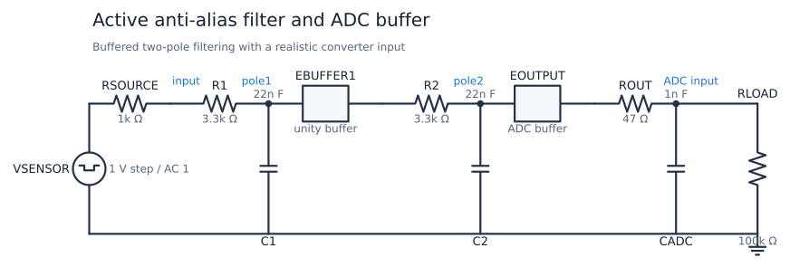
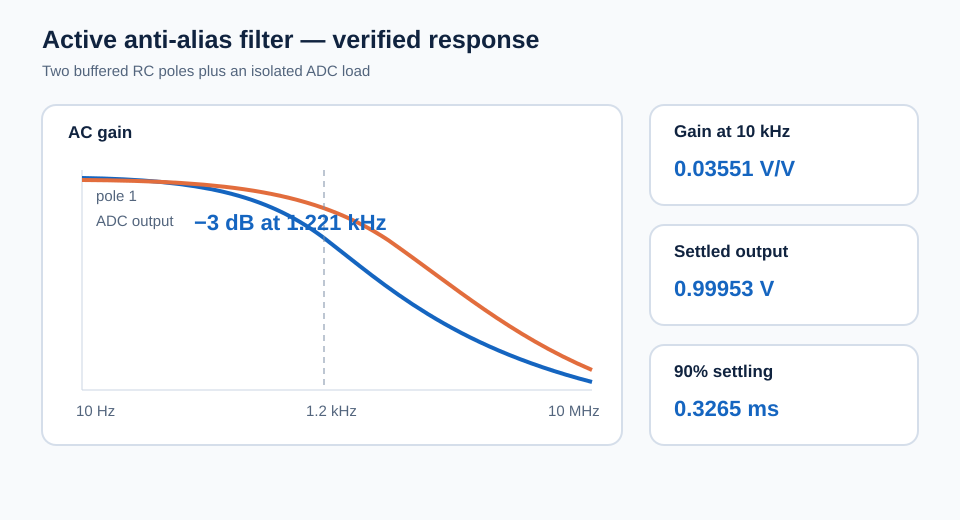

# Active Anti-Alias Filter and ADC Buffer

This circuit limits sensor bandwidth before analog-to-digital conversion. Two
buffered RC poles provide substantially more high-frequency attenuation than a
single pole, while a final unity-gain buffer and 47 ohm isolation resistor
drive a capacitive ADC input without loading the filter stages.

| Property | Value |
| --- | --- |
| Requires | `SpiceSharp-Parser` |
| Dialect | Portable-style SPICE |
| Analyses | AC, TRAN |
| Difficulty | Medium |
| Verified with | SpiceSharpParser 3.4.x repository tests |
| External cross-check | Not yet performed |

## Design Targets

| Target | Value |
| --- | ---: |
| Passband gain | Approximately unity |
| Composite -3 dB frequency | About 1.2 kHz |
| Gain at 10 kHz | Below 0.05 V/V |
| ADC static load | 100 kohm |
| ADC input capacitance | 1 nF |
| 90 percent step settling | Below 0.4 ms |

## Schematic



The names match
[`active-anti-alias-filter.cir`](active-anti-alias-filter.cir). `EBUFFER1`
isolates the first pole from `R2` and `C2`; `EOUTPUT` isolates both poles from
`ROUT`, `CADC`, and `RLOAD`.

## Runnable Netlist

The complete circuit is in
[`active-anti-alias-filter.cir`](active-anti-alias-filter.cir). The filter and
buffer chain is:

```spice
R1 input pole1 3.3k
C1 pole1 0 22n
EBUFFER1 buffer1 0 pole1 0 1
R2 buffer1 pole2 3.3k
C2 pole2 0 22n
EOUTPUT output 0 pole2 0 1
ROUT output adc 47
CADC adc 0 1n
RLOAD adc 0 100k
```

## How It Works

`RSOURCE` makes the sensor impedance explicit. It adds to `R1`, so the first
pole is lower than the second. `EBUFFER1` has infinite input impedance and
unity gain, preventing the second stage from altering the first stage's RC
calculation. The cascaded response rolls off toward 40 dB per decade.

`EOUTPUT` provides an idealized low-impedance driver. `ROUT` isolates it from
the converter capacitance and limits any sampling transient. `RLOAD` creates a
small, measurable DC gain error instead of leaving the output unloaded.

## Design Calculations

The first and second pole frequencies are approximately:

$$
f_1=\frac{1}{2\pi(1\text{ k}\Omega+3.3\text{ k}\Omega)(22\text{ nF})}
=1.68\text{ kHz}
$$

$$
f_2=\frac{1}{2\pi(3.3\text{ k}\Omega)(22\text{ nF})}
=2.19\text{ kHz}
$$

At 10 kHz the first stage predicts 0.166 V/V. Multiplying by the second
stage's approximately 0.214 V/V gives 0.0355 V/V, matching the simulation.
The 47 ohm and 100 kohm output divider gives a final DC gain of 0.99953.

## Simulation Setup

`.AC` sweeps 10 Hz to 10 MHz with 50 points per decade. The 1 V small-signal
source makes each measured magnitude equal to gain in V/V. `.TRAN` applies a
1 V step at 1 ms and uses a 100 ns maximum timestep so the 47 ohm/1 nF output
network is also resolved. The 90 percent settling measurement is relative to
the source and output threshold crossings.



## Verified Measurements

| Measurement | Expected range | Verified result |
| --- | ---: | ---: |
| Gain at 100 Hz | 0.97 to 1.01 V/V | 0.9967 V/V |
| Gain at 1 kHz | 0.74 to 0.82 V/V | 0.7817 V/V |
| Gain at 10 kHz | 0.030 to 0.042 V/V | 0.03551 V/V |
| First-stage gain at 10 kHz | 0.15 to 0.18 V/V | 0.1659 V/V |
| Composite -3 dB frequency | 1.10 to 1.35 kHz | 1.221 kHz |
| Settled output | 0.995 to 1.002 V | 0.99953 V |
| Output peak | 0.995 to 1.002 V | 0.99953 V |
| 90 percent settling delay | 0.28 to 0.38 ms | 0.3265 ms |

## Real-World Applications

This signal chain fits low-rate sensor and instrumentation channels that feed
a successive-approximation ADC: temperature, pressure, strain, vibration, and
industrial data-acquisition inputs are typical examples. The same buffered
low-pass pattern can be rescaled for other sampled systems, including audio,
scientific instruments, and medical equipment.

The two poles attenuate energy that could alias into the sampled band, while
the final buffer and isolation resistor help drive converter input capacitance.
A real design must derive its passband and stopband from sample rate and
accuracy, then use an op-amp stable with the chosen ADC load. See Analog
Devices' [anti-aliasing filter basics](https://www.analog.com/en/resources/technical-articles/guide-to-antialiasing-filter-basics.html)
and [SAR ADC front-end RC design guide](https://www.analog.com/en/resources/analog-dialogue/articles/front-end-amp-and-rc-filter-design.html).

## Experiments

- Remove `EBUFFER1` and observe how the second stage loads the first.
- Make `R1` and `R2` equal after including source resistance, then compare the
  composite corner.
- Increase `CADC` to model a heavier converter input.
- Increase `ROUT` and measure the added pole and slower sampling response.
- Move both RC poles lower before reducing a hypothetical sample rate.

## Model Boundary

The unity-gain controlled sources have infinite input impedance, zero output
impedance, unlimited current, infinite bandwidth, and no supply rails. They do
not model op-amp noise, input bias current, offset, slew rate, stability,
common-mode limits, or output swing. `CADC` is a static capacitance rather than
a switched-capacitor sampling model. A production anti-alias filter must be
sized from the converter sample rate and required stopband attenuation.

## Running and Testing

Compile with `SpiceCompiler.CompileFile(...)`, execute the AC and transient
simulations, and inspect the measurements and saved exports. Run:

```powershell
.\tools\cookbook-schematic\.venv\Scripts\cookbook-report

dotnet test src/SpiceSharpParser.Tests/SpiceSharpParser.Tests.csproj `
  --filter 'FullyQualifiedName~CircuitCookbookTests'
```
