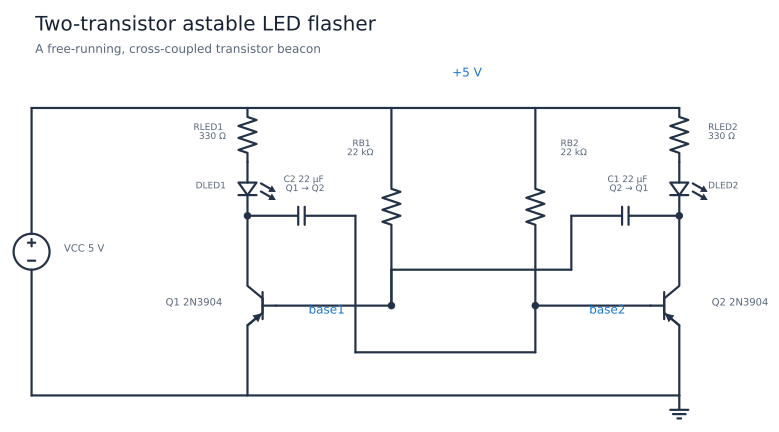
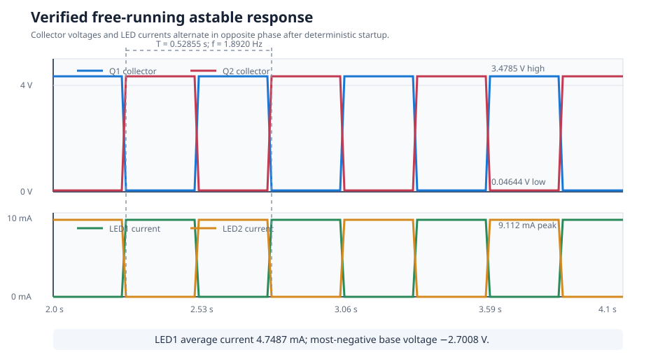

# Two-Transistor Astable LED Flasher

This free-running beacon uses two NPN transistors, two LEDs, and two
cross-coupled RC networks. Each transistor alternately saturates while the
other turns off, so the LEDs flash in opposite phases without a clock source
or timer IC. The verified flash rate is about 1.89 Hz.

| Property | Value |
| --- | --- |
| Requires | `SpiceSharp-Parser` |
| Dialect | Portable-style SPICE |
| Analysis | TRAN |
| Difficulty | Simple |
| Verified with | SpiceSharpParser 3.4.x repository tests |
| External cross-check | Not yet performed |

## Design Targets

| Target | Value |
| --- | ---: |
| Supply | 5 V |
| Timing resistors | 22 kohm each |
| Timing capacitors | 22 uF each |
| LED resistors | 330 ohm each |
| Flash rate | About 1 to 2 Hz |
| LED peak current | About 9 mA |
| Collector low voltage | Below 0.1 V |
| Base reverse excursion | Less than 3 V magnitude |

## Schematic



The component names match
[`astable-led-flasher.cir`](astable-led-flasher.cir). `C2` couples the first
collector to the second base; `C1` closes the positive-feedback loop from the
second collector to the first base. A 10 mV initial imbalance on `C1` starts
the otherwise symmetric simulated oscillator.

## Runnable Netlist

One half and the two cross-coupling capacitors are:

```spice
RLED1 vcc led1_anode 330
DLED1 led1_anode collector1 DRED
Q1 collector1 base1 0 Q2N3904
RB1 vcc base1 22k
C1 collector2 base1 22u IC=10m

C2 collector1 base2 22u IC=0
```

The second LED, transistor, and base resistor mirror the first half.

## How It Works

Suppose `Q1` turns on first. Its collector falls close to ground, lighting
`DLED1`. Through `C2`, that falling edge pulls `base2` negative and turns
`Q2` firmly off. `RB2` then charges `C2` toward the 5 V rail. When `base2`
again reaches the forward base-emitter threshold, `Q2` turns on.

The second collector now falls, `C1` drives `base1` negative, and the states
swap. Because neither state is stable, the cycle repeats. The LEDs are in the
collector loads, so the LED associated with the conducting transistor lights.

## Design Calculations

Each timing network has:

$$
RC=(22\text{ k}\Omega)(22\text{ uF})=0.484\text{ s}
$$

A common symmetric first-order estimate is:

$$
T\approx2\ln(2)RC=0.671\text{ s},\qquad f\approx1.49\text{ Hz}
$$

The transistor thresholds, finite LED collector loads, and actual negative
base excursion shorten the simulated period to 0.5286 s, or 1.892 Hz. LED
current is approximately:

$$
I_{LED}\approx\frac{5-V_F-V_{CE(sat)}}{330\ \Omega}\approx9\text{ mA}
$$

which matches the 9.112 mA measured peak.

## Simulation Setup

The Gear transient runs for 5 s with a 100 us maximum timestep. `UIC` applies
the 10 mV capacitor imbalance that represents unavoidable real component
mismatch and lets startup remain deterministic. Period measurements use the
fourth and fifth collector rising edges; current and voltage extrema use the
settled 2 to 4 s window.



## Verified Measurements

| Measurement | Expected range | Verified result |
| --- | ---: | ---: |
| Q1 collector period | 0.50 to 0.56 s | 0.52855 s |
| Q2 collector period | 0.50 to 0.56 s | 0.52855 s |
| Blink frequency | 1.75 to 2.05 Hz | 1.8920 Hz |
| LED1 peak current | 8.5 to 9.7 mA | 9.1123 mA |
| LED2 peak current | 8.5 to 9.7 mA | 9.1123 mA |
| LED1 average current | 4.2 to 5.3 mA | 4.7487 mA |
| Collector low voltage | 0.02 to 0.08 V | 0.04644 V |
| Collector high voltage | 3.3 to 3.7 V | 3.4785 V |
| Most-negative base voltage | -2.9 to -2.5 V | -2.7008 V |

## Real-World Applications

Astable multivibrators provide low-cost warning beacons, alternating status
lights, simple clocks, tone sources after RC rescaling, and an accessible
demonstration of regenerative switching. Analog Devices' [BJT multivibrator
activity](https://www.analog.com/en/resources/analog-dialogue/studentzone/studentzone-july-2022.html)
uses the same pair of common-emitter stages, LEDs, and cross-coupled timing
capacitors. The onsemi [2N3904 data sheet](https://www.onsemi.com/download/data-sheet/pdf/2n3904-d.pdf)
provides the real transistor's voltage, current, and power limits.

For accurate timing, low supply current, or guaranteed startup, use a timer,
Schmitt-trigger oscillator, or microcontroller. The discrete astable remains
valuable when tolerance is loose and the behavior itself is the lesson.

## Experiments

- Double both capacitors and confirm that the flash rate roughly halves.
- Make `C1` different from `C2` to create unequal on-times.
- Change one `RB` value and compare the two half-cycles.
- Increase the LED resistors to reduce peak and average current.
- Remove the initial mismatch and explore numerical versus physical startup.
- Add base-emitter clamp diodes and compare timing and reverse voltage.

## Model Boundary

The LED and transistor models are compact educational models. They omit part
tolerances, temperature spread, capacitor leakage and ESR, LED brightness and
color variation, battery impedance, wiring parasitics, and thermal behavior.
The explicit initial condition stands in for real mismatch and noise. The
collector-high voltage is below 5 V because the off-side coupling capacitor
continues charging through the LED branch. Check transistor reverse
base-emitter rating before raising the supply or changing the timing network.

## Running and Testing

Compile with `SpiceCompiler.CompileFile(...)`, run the transient simulation,
and inspect both collector voltages and LED currents. Run:

```powershell
.\tools\cookbook-schematic\.venv\Scripts\cookbook-report

dotnet test src/SpiceSharpParser.Tests/SpiceSharpParser.Tests.csproj `
  --filter 'FullyQualifiedName~CircuitCookbookTests'
```


