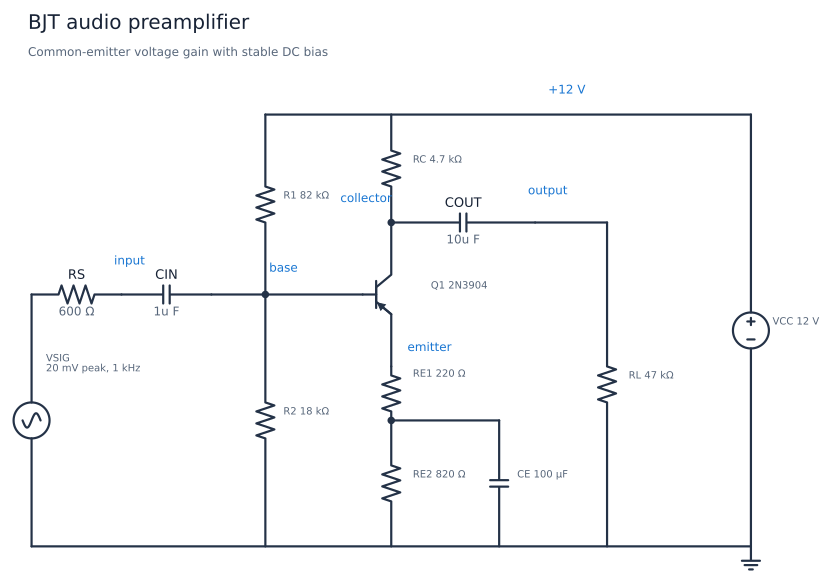
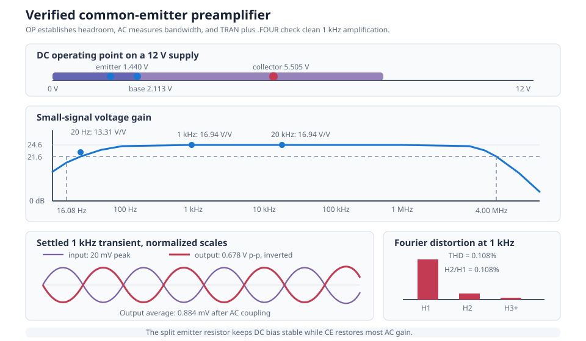

# BJT Audio Preamplifier

This circuit is a single-transistor common-emitter voltage amplifier for a
small audio or sensor signal. A 20 mV peak, 1 kHz input from a 600 ohm source
becomes approximately 0.678 V peak-to-peak at a 47 kohm load. The stage uses a
12 V supply and biases its collector near mid-supply for useful output
headroom.

| Property | Value |
| --- | --- |
| Requires | `SpiceSharp-Parser` |
| Dialect | Portable-style SPICE |
| Analyses | OP, AC, TRAN, FOUR |
| Difficulty | Medium |
| Verified with | SpiceSharpParser 3.4.x repository tests |
| External cross-check | Not yet performed |

## Design Targets

| Target | Value |
| --- | ---: |
| Supply | 12 V |
| Source impedance | 600 ohm |
| Load | 47 kohm |
| Nominal input | 20 mV peak at 1 kHz |
| Collector bias | About 6 V |
| Midband voltage gain | 14 to 20 V/V |
| Audio passband | At least 20 Hz to 20 kHz |
| Small-signal THD | Below 0.5 percent at 1 kHz |

## Schematic



The node and component names match
[`bjt-audio-preamplifier.cir`](bjt-audio-preamplifier.cir). `RE1` supplies
local AC feedback, while `RE2` establishes most of the DC emitter
resistance. `CE` bypasses `RE2` at audio frequencies.

## Runnable Netlist

The complete circuit is in
[`bjt-audio-preamplifier.cir`](bjt-audio-preamplifier.cir). Its amplifier core
is:

```spice
R1 vcc base 82k
R2 base 0 18k
Q1 collector base emitter Q2N3904
RC vcc collector 4.7k
RE1 emitter emitter_bypass 220
RE2 emitter_bypass 0 820
CE emitter_bypass 0 100u
```

The checked-in transistor model is intentionally compact and reproducible. It
includes finite current gain, Early effect, junction capacitances, base and
terminal resistances, and forward/reverse transit times.

## How It Works

`R1` and `R2` form a divider that holds the base near 2.1 V.
The base-emitter junction subtracts about 0.67 V, leaving the emitter near
1.44 V. Approximately 1.4 mA then flows through the 1.04 kohm total emitter
resistance.

The collector current creates a voltage drop across `RC`, placing the collector
at 5.505 V. When the input voltage rises, collector current rises and the
collector voltage falls, so a common-emitter stage inverts the signal.

`CIN` prevents the source from disturbing the divider's DC bias. `COUT` removes
the collector's DC level before the signal reaches `RL`. `RE1` improves
bias stability, gain predictability, and linearity. `CE` makes `RE2` a low
AC impedance through most of the audio band, recovering voltage gain without
giving up its DC feedback.

## Design Calculations

Ignoring base current, the divider predicts:

$$
V_B=12\frac{18\text{k}}{82\text{k}+18\text{k}}=2.16\ \text{V}
$$

The simulated base voltage is 2.113 V because the transistor loads the divider.
With the measured 1.440 V emitter voltage:

$$
I_E\approx\frac{1.440}{220+820}=1.385\ \text{mA}
$$

The approximate small-signal emitter resistance is:

$$
r_e\approx\frac{25.8\ \text{mV}}{1.385\ \text{mA}}=18.6\ \Omega
$$

At midband, `CE` largely bypasses the 820 ohm resistor. A first-order gain
estimate is therefore:

$$
|A_v|\approx\frac{4.7\text{k}\parallel47\text{k}}{220+r_e}
=17.9\ \text{V/V}
$$

The measured gain is 16.94 V/V after including the transistor model, source
loading, and incomplete bypass impedance. From a 20 mV peak input, this predicts
roughly 0.678 V peak-to-peak, matching the transient measurement.

## Simulation Setup

`.OP` verifies the quiescent base, emitter, and collector voltages. `.AC` uses a
1 V small-signal source and sweeps 10 Hz to 100 MHz with 40 points per decade.
This makes `VM(output)` numerically equal to voltage gain in V/V and captures
both coupling-capacitor and transistor-model roll-off.

`.TRAN` runs 20 cycles of the 1 kHz input with a 2 us maximum timestep.
Measurements use the final five cycles after coupling-capacitor startup has
settled. `.FOUR` analyzes the last complete output period through the ninth
harmonic.

`.SAVE` requests the source, input, base, collector, emitter, and output
voltages. `.PLOT` requests the AC output magnitude.



## Verified Measurements

| Measurement | Expected range | Verified result |
| --- | ---: | ---: |
| Collector DC bias | 4.5 to 6.5 V | 5.505 V |
| Base DC bias | 1.9 to 2.3 V | 2.113 V |
| Emitter DC bias | 1.2 to 1.7 V | 1.440 V |
| Gain at 20 Hz | 11 to 16 V/V | 13.309 V/V |
| Gain at 1 kHz | 14 to 20 V/V | 16.941 V/V |
| Gain at 20 kHz | 14 to 20 V/V | 16.942 V/V |
| Gain at 1 MHz | 13 to 20 V/V | 16.437 V/V |
| Lower -3 dB point | 10 to 20 Hz | 16.077 Hz |
| Upper -3 dB point | 2 to 8 MHz | 4.002 MHz |
| Settled output swing | 0.55 to 0.80 V p-p | 0.678 V p-p |
| Settled output average | -10 to 10 mV | 0.884 mV |

The netlist-native Fourier result reports 0.108 percent THD at 1 kHz. The
second harmonic is 0.108 percent of the fundamental; the remaining measured
harmonics are much smaller. Fourier output is asserted separately from the
`.MEAS` table because `.FOUR` produces structured harmonic data rather than a
scalar `.MEAS` result.

## Experiments

- Remove `CE` to observe the large gain reduction and improved linearity from
  the full 1.04 kohm emitter degeneration.
- Reduce `CIN` to 100 nF and measure the higher low-frequency cutoff.
- Change `RL` to 10 kohm to see collector loading reduce the gain.
- Raise the input amplitude until the collector approaches saturation or the
  supply rail, then compare the waveform and THD with the small-signal result.
- Change `RE1` to trade gain for linearity and bias tolerance.
- Sweep transistor current gain or temperature to see why divider bias and
  emitter degeneration matter.

## Model Boundary

This example is a voltage preamplifier, not a power amplifier. The 47 kohm load
represents a following high-impedance stage; it cannot drive a speaker or low-
impedance headphones directly.

The compact generic 2N3904-style model is suitable for teaching bias,
small-signal gain, coupling, and first-order distortion. It does not guarantee
the behavior of a particular vendor part. The circuit omits resistor and
capacitor tolerances, transistor noise, microphone bias, PCB coupling,
electromagnetic interference, thermal self-heating, supply decoupling, and a
volume control. The simulated upper cutoff depends strongly on the compact
model's capacitance and transit-time parameters.

## Running and Testing

Compile and simulate it from C#:

```csharp
using System;
using SpiceSharpParser;
using SpiceSharpParser.Common;

SpiceCompilationResult result =
    SpiceCompiler.CompileFile("bjt-audio-preamplifier.cir");

if (!result.Success)
{
    throw new InvalidOperationException(
        string.Join(Environment.NewLine, result.Diagnostics));
}

foreach (var simulation in result.Model.Simulations)
{
    simulation.Execute(result.Model.Circuit);
}
```

Run the cookbook quality gate and regression test:

```powershell
.\tools\cookbook-schematic\.venv\Scripts\cookbook-report

dotnet test src/SpiceSharpParser.Tests/SpiceSharpParser.Tests.csproj `
  --filter 'FullyQualifiedName~CircuitCookbookTests'
```
