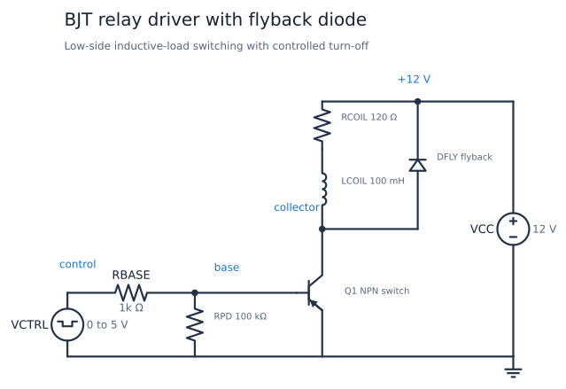
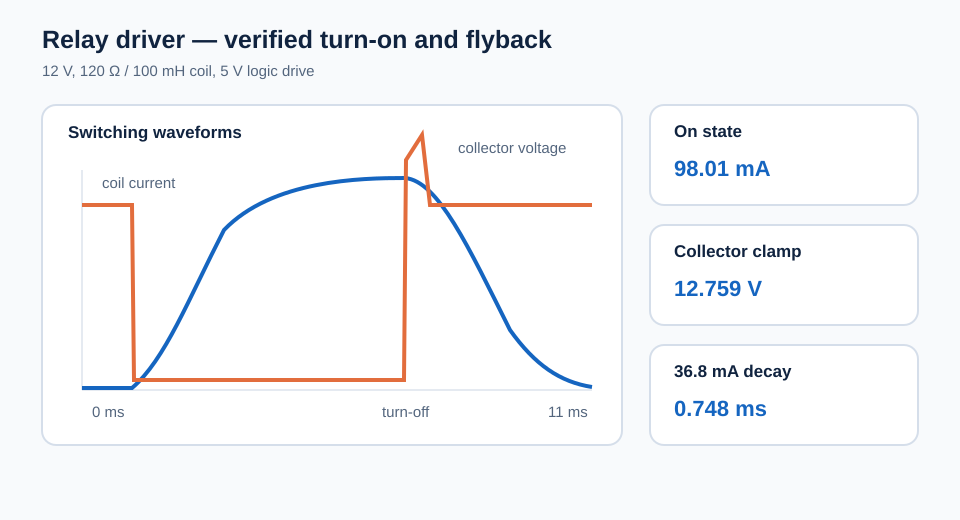

# BJT Relay Driver with Flyback Diode

This low-side switch lets a 5 V logic signal energize a 12 V relay or small
solenoid coil. The NPN transistor supplies the coil current, the base resistor
limits logic-pin current, the pull-down keeps the switch off when its input is
floating, and the flyback diode provides a controlled path for stored magnetic
energy at turn-off.

| Property | Value |
| --- | --- |
| Requires | `SpiceSharp-Parser` |
| Dialect | Portable-style SPICE |
| Analyses | TRAN |
| Difficulty | Simple |
| Verified with | SpiceSharpParser 3.4.x repository tests |
| External cross-check | Not yet performed |

## Design Targets

| Target | Value |
| --- | ---: |
| Logic drive | 0 to 5 V |
| Coil supply | 12 V |
| Coil resistance and inductance | 120 ohm, 100 mH |
| Steady coil current | About 100 mA |
| Saturated collector voltage | Below 0.2 V |
| Flyback collector peak | Below 13 V |
| Base current | About 4 mA |

## Schematic



The component and node names match
[`bjt-relay-driver.cir`](bjt-relay-driver.cir). `RCOIL` and `LCOIL` are the
electrical relay-coil model. `DFLY` is normally reverse biased and conducts
only when `Q1` turns off.

## Runnable Netlist

The complete circuit is in [`bjt-relay-driver.cir`](bjt-relay-driver.cir).
The switched path is:

```spice
RBASE control base 1k
RPD base 0 100k
Q1 collector base 0 QSW
RCOIL vcc coil 120
LCOIL coil collector 100m IC=0
DFLY collector vcc DFLYBACK
```

## How It Works

When `VCTRL` rises, current flows through `RBASE` into the transistor base.
`Q1` saturates and connects the coil's lower terminal close to ground. Coil
current rises according to its electrical time constant. `RPD` discharges the
base and defines the off state if the controller is disconnected.

At turn-off, inductor current cannot change instantly. The collector rises
until `DFLY` becomes forward biased, creating a loop through the coil and
diode. The transistor sees only the 12 V rail plus the diode drop. The price of
this low-voltage clamp is a slower relay release than a higher-voltage TVS or
Zener clamp would produce.

## Design Calculations

Ignoring the small saturation voltage, steady coil current is:

$$
I_{coil}\approx\frac{12}{120}=100\text{ mA}
$$

The measured 0.089 V collector voltage gives 99.3 mA as the asymptotic value.
The electrical time constant is:

$$
\tau=\frac{L}{R}=\frac{100\text{ mH}}{120\ \Omega}=0.833\text{ ms}
$$

With about 0.776 V at the base, the 1 kohm resistor supplies:

$$
I_B\approx\frac{5-0.776}{1\text{ k}\Omega}=4.22\text{ mA}
$$

The forced current gain is therefore about 23, comfortably below the model's
forward gain and suitable for saturation.

## Simulation Setup

The control pulse rises at 1 ms and falls at 6.001 ms. A Gear transient runs
to 11 ms with a 1 us maximum timestep and zero initial coil current. The
measurements cover the steady on state, the flyback peak, current one
millisecond after turn-off, and the delay until current decays to 36.8 mA.



## Verified Measurements

| Measurement | Expected range | Verified result |
| --- | ---: | ---: |
| Coil on-current | 94 to 102 mA | 98.01 mA |
| Collector on-voltage | 0.04 to 0.16 V | 0.089 V |
| Base drive current | 3.8 to 4.6 mA | 4.224 mA |
| Collector flyback peak | 12.5 to 13.1 V | 12.759 V |
| Flyback-diode peak current | 94 to 103 mA | 98.98 mA |
| Coil current 1 ms after turn-off | 20 to 32 mA | 25.73 mA |
| Decay to 36.8 mA | 0.60 to 0.90 ms | 0.748 ms |

## Real-World Applications

This low-side stage is a common interface between logic and an inductive load:
appliance and industrial controllers use it for relay coils, solenoid valves,
small contactors, buzzers, and similar on/off actuators. The relay contacts can
then switch a load or voltage domain that the microcontroller cannot handle
directly.

The modeled 100 mA coil is near the useful switching range stated for a
2N3904, so a real design needs adequate current, voltage, power, and thermal
margin; a logic-level MOSFET or integrated driver is often better at higher
current. A plain flyback diode minimizes transistor voltage but slows release,
while a TVS or Zener clamp releases the actuator faster at higher switch
stress. See TI's [Basics of Power Switches](https://www.ti.com/lit/slva927)
and the onsemi [2N3904 data sheet](https://www.onsemi.com/download/data-sheet/pdf/2n3904-d.pdf).

## Experiments

- Remove `DFLY` and observe why unclamped inductive turn-off is unsafe.
- Replace the diode with a higher-voltage clamp model and compare release time.
- Increase `RBASE` until transistor saturation and coil current degrade.
- Change `LCOIL` to separate steady current from turn-on and release speed.
- Change `RCOIL` to represent another relay or solenoid.

## Model Boundary

The example models only the coil's resistance and inductance. It omits contact
bounce, mechanical force, armature motion, release thresholds, contact arcing,
temperature rise, transistor safe-operating-area limits, logic-pin current
limits, wiring inductance, and supply decoupling. The generic BJT and diode are
educational models rather than vendor-specific parts. A real design must check
coil tolerance, transistor current and power ratings, and logic compatibility.

## Running and Testing

Compile the netlist with `SpiceCompiler.CompileFile(...)`, execute the returned
transient simulation, and inspect the measurements and saved waveforms. Run:

```powershell
.\tools\cookbook-schematic\.venv\Scripts\cookbook-report

dotnet test src/SpiceSharpParser.Tests/SpiceSharpParser.Tests.csproj `
  --filter 'FullyQualifiedName~CircuitCookbookTests'
```
