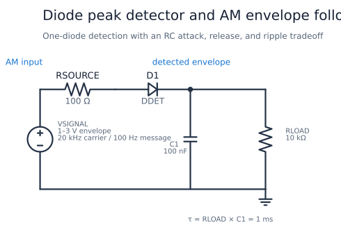
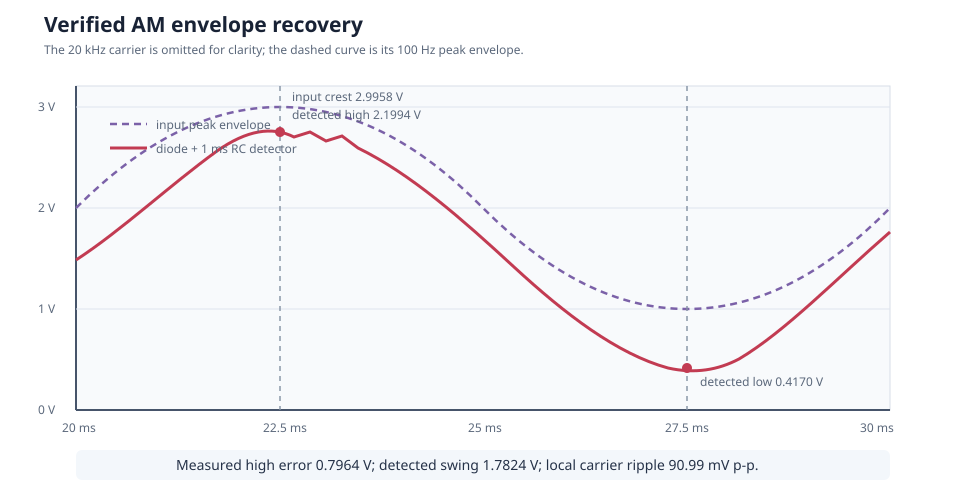

# Diode Peak Detector and AM Envelope Follower

This circuit recovers the slowly changing amplitude of a 20 kHz carrier with
one diode, one capacitor, and one load resistor. The input envelope varies
from 1 V to 3 V at 100 Hz. The example makes the simple detector's diode-drop
error, carrier ripple, charging current, and release-time tradeoff visible.

| Property | Value |
| --- | --- |
| Requires | `SpiceSharp-Parser` |
| Dialect | Portable-style SPICE |
| Analysis | TRAN |
| Difficulty | Simple |
| Verified with | SpiceSharpParser 3.4.x repository tests |
| External cross-check | Not yet performed |

## Design Targets

| Target | Value |
| --- | ---: |
| Carrier frequency | 20 kHz |
| Message frequency | 100 Hz |
| Input envelope | 1 to 3 V peak |
| Source resistance | 100 ohm |
| Detector capacitor | 100 nF |
| Detector load | 10 kohm |
| Release time constant | 1 ms |
| Carrier ripple near envelope maximum | Below 120 mV p-p |

## Schematic



The names match
[`diode-envelope-detector.cir`](diode-envelope-detector.cir). `D1` charges
`C1` from positive carrier peaks. `RLOAD` both represents the following stage
and gives the stored voltage a defined release path.

## Runnable Netlist

The complete detector is:

```spice
VSIGNAL input 0 AM(1 2 100 20k 0 0 0)
RSOURCE input diode_input 100
D1 diode_input envelope DDET
C1 envelope 0 100n IC=0
RLOAD envelope 0 10k
```

The parser's `AM` source produces
`(2 + sin(2*pi*100*t)) * sin(2*pi*20k*t)`, giving a positive peak envelope
from 1 V to 3 V.

## How It Works

When an input crest rises above the stored capacitor voltage by one forward
diode drop, `D1` conducts and quickly replenishes `C1`. After the crest, the
diode becomes reverse biased. The capacitor then supplies `RLOAD` and decays
exponentially until a later carrier peak is high enough to recharge it.

A longer RC time constant reduces carrier ripple but follows a falling
envelope more slowly. A shorter time constant follows the message more
closely but lets more carrier appear at the output. This design places the
1 ms time constant between the 50 us carrier period and 10 ms message period.

## Design Calculations

The detector release constant is:

$$
\tau=R_{LOAD}C_1=(10\text{ k}\Omega)(100\text{ nF})=1\text{ ms}
$$

The carrier and message periods are:

$$
T_c=\frac{1}{20\text{ kHz}}=50\text{ us},\qquad
T_m=\frac{1}{100\text{ Hz}}=10\text{ ms}
$$

Thus `Tc < tau < Tm`. Near the measured 2.20 V high output, one carrier
period of unloaded exponential decay predicts an upper-bound droop of:

$$
\Delta V\approx2.20(1-e^{-50\text{ us}/1\text{ ms}})=107\text{ mV}
$$

The measured local ripple is 90.99 mV peak-to-peak. The detected maximum is
2.199 V rather than the 2.996 V input crest because diode forward voltage,
source resistance, load discharge, and finite charging time all contribute.

## Simulation Setup

The Gear transient runs for 30 ms, covering three complete 100 Hz message
cycles, with a 1 us maximum timestep that resolves the 20 kHz carrier with
50 points per cycle. Measurements use the last message cycle so startup from
the empty capacitor does not affect the reported envelope.



## Verified Measurements

| Measurement | Expected range | Verified result |
| --- | ---: | ---: |
| Input positive peak | 2.98 to 3.01 V | 2.9958 V |
| Detected high envelope | 2.15 to 2.25 V | 2.1994 V |
| Detected low envelope | 0.38 to 0.48 V | 0.4170 V |
| High-peak error | 0.74 to 0.85 V | 0.7964 V |
| Detected envelope swing | 1.70 to 1.85 V | 1.7824 V |
| Local carrier ripple | 70 to 120 mV p-p | 90.99 mV p-p |
| Peak diode current | 1.5 to 3.5 mA | 2.310 mA |

## Real-World Applications

Envelope detectors recover amplitude information in AM radio receivers,
simple audio level meters, signal-presence detectors, and peak-hold or
automatic-gain-control front ends. Analog Devices explains the same diode and
RC mechanism in its [envelope-detector activity](https://wiki.analog.com/university/courses/electronics/electronics-lab-envelope-detector)
and summarizes basic peak-detector limitations in its
[diode applications chapter](https://wiki.analog.com/university/courses/electronics/text/chapter-7).

For low-level or precision signals, use a Schottky diode, biased detector,
precision rectifier, or integrated envelope detector. The input normally also
needs band-pass filtering so unrelated carriers and noise are not detected.

## Experiments

- Increase `C1` and compare lower carrier ripple with slower envelope decay.
- Reduce `RLOAD` to model a heavier following stage.
- Raise the carrier frequency while preserving the 1 ms time constant.
- Replace `D1` with a lower-drop Schottky model and compare peak error.
- Change the AM offset from 2 toward 1 to explore deep modulation.

## Model Boundary

The AM source is ideal and contains no noise, adjacent channels, carrier drift,
or source bandwidth limit. The diode model is generic and omits package
parasitics, temperature sweeps, reverse recovery detail, and part tolerances.
The load is purely resistive and there is no following amplifier. This recipe
is suitable for envelope timing and error intuition, not receiver sensitivity
or production RF performance.

## Running and Testing

Compile with `SpiceCompiler.CompileFile(...)`, run the transient simulation,
and inspect its measurements and plot. Run:

```powershell
.\tools\cookbook-schematic\.venv\Scripts\cookbook-report

dotnet test src/SpiceSharpParser.Tests/SpiceSharpParser.Tests.csproj `
  --filter 'FullyQualifiedName~CircuitCookbookTests'
```


