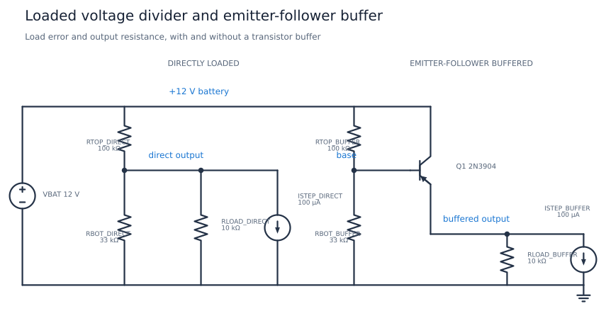
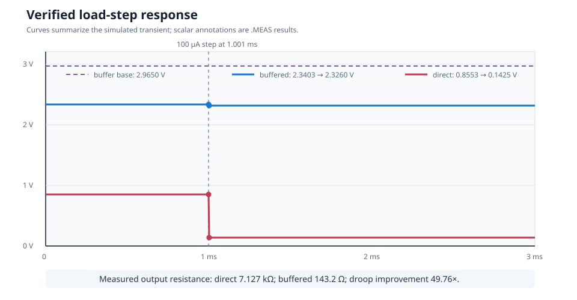

# Loaded Voltage Divider and Emitter-Follower Buffer

This circuit compares two ways to scale a 12 V battery for a 10 kohm load.
A plain 100 kohm / 33 kohm divider collapses under that load. An identical
divider driving an NPN emitter follower keeps most of its divider voltage and
reduces the small-signal output resistance by about fifty times, while adding
the transistor's base-emitter voltage offset.

| Property | Value |
| --- | --- |
| Requires | `SpiceSharp-Parser` |
| Dialect | Portable-style SPICE |
| Analyses | OP, TRAN |
| Difficulty | Simple |
| Verified with | SpiceSharpParser 3.4.x repository tests |
| External cross-check | Not yet performed |

## Design Targets

| Target | Value |
| --- | ---: |
| Battery voltage | 12 V |
| Divider | 100 kohm / 33 kohm |
| Load on each branch | 10 kohm |
| Additional load step | 100 uA at 1 ms |
| Direct loaded output | About 0.86 V |
| Buffered output | About 2.34 V |
| Direct output resistance | About 7.1 kohm |
| Buffered output resistance | Below 200 ohm |
| Droop improvement | More than 40 times |

## Schematic



The component and node names match
[`loaded-voltage-divider.cir`](loaded-voltage-divider.cir). The left branch is
the directly loaded divider. The right branch inserts `Q1` between the same
divider and load. Both branches receive the same 100 uA current step.

## Runnable Netlist

The two signal paths are:

```spice
RTOP_DIRECT vbat direct 100k
RBOT_DIRECT direct 0 33k
RLOAD_DIRECT direct 0 10k
ISTEP_DIRECT direct 0 PWL(0 0 1m 0 1.001m 100u 3m 100u)

RTOP_BUFFER vbat base 100k
RBOT_BUFFER base 0 33k
Q1 vbat base buffered Q2N3904
RLOAD_BUFFER buffered 0 10k
ISTEP_BUFFER buffered 0 PWL(0 0 1m 0 1.001m 100u 3m 100u)
```

## How It Works

A voltage divider only produces its textbook voltage when its output is
unloaded. The 10 kohm direct load is in parallel with the 33 kohm lower
resistor, so it changes the divider ratio substantially. The additional
100 uA current sink produces another large voltage drop through the divider's
Thevenin resistance.

The emitter follower draws only base current from the divider but supplies the
load from the 12 V rail through its collector. Its voltage gain is near one
and its output resistance is much lower. The tradeoff is that `buffered` sits
about one base-emitter drop below `base`; the buffer improves drive strength,
not DC accuracy.

## Design Calculations

Without a load, the divider would produce:

$$
V_{ideal}=12\frac{33}{100+33}=2.977\text{ V}
$$

Its Thevenin resistance is:

$$
R_{th}=100\text{ k}\Omega\parallel33\text{ k}\Omega=24.81\text{ k}\Omega
$$

With the 10 kohm load, the direct branch becomes:

$$
V_{direct}=12\frac{33\text{ k}\Omega\parallel10\text{ k}\Omega}
{100\text{ k}\Omega+(33\text{ k}\Omega\parallel10\text{ k}\Omega)}
=0.855\text{ V}
$$

The resistance seen by the current step is
`100k || 33k || 10k = 7.127 kohm`, so a 100 uA step predicts
`0.713 V` of direct droop. Simulation gives the same value. The buffered
branch droops only 14.32 mV, corresponding to 143.2 ohm and a 49.76-times
improvement.

## Simulation Setup

`.OP` records the two loaded DC outputs and the transistor base voltage.
`.TRAN` runs for 3 ms with a 1 us maximum timestep. Both current sources step
from zero to 100 uA at 1.001 ms. Measurements average settled windows before
and after the step, then derive voltage droop and output resistance.



## Verified Measurements

| Measurement | Expected range | Verified result |
| --- | ---: | ---: |
| Direct loaded voltage | 0.84 to 0.87 V | 0.8553 V |
| Buffer base voltage | 2.94 to 2.99 V | 2.9650 V |
| Buffered loaded voltage | 2.31 to 2.37 V | 2.3403 V |
| Direct voltage before step | 0.84 to 0.87 V | 0.8553 V |
| Direct voltage after step | 0.13 to 0.16 V | 0.1425 V |
| Buffered voltage before step | 2.31 to 2.37 V | 2.3403 V |
| Buffered voltage after step | 2.30 to 2.35 V | 2.3260 V |
| Direct droop | 0.69 to 0.74 V | 0.7127 V |
| Buffered droop | 10 to 20 mV | 14.32 mV |
| Direct output resistance | 6.9 to 7.4 kohm | 7.127 kohm |
| Buffered output resistance | 100 to 200 ohm | 143.2 ohm |
| Droop improvement | 40 to 60 times | 49.76 times |

## Real-World Applications

Voltage dividers scale battery, supply, and sensor voltages for monitor inputs
and establish transistor bias points. A follower is useful when the following
load is too heavy for the divider, or when a high-impedance source must drive
a lower-impedance stage. Analog Devices describes the emitter follower as an
impedance-matching buffer in its
[single-transistor amplifier chapter](https://wiki.analog.com/university/courses/electronics/text/chapter-9)
and demonstrates practical 2N3904 followers in its
[emitter-follower activity](https://www.analog.com/en/resources/analog-dialogue/studentzone/studentzone-april-2021.html).

For precision ADC scaling, a rail-to-rail op-amp buffer is often better because
the BJT's base-emitter offset varies with current and temperature. Many ADCs
already have high static input resistance but still draw dynamic sampling
current, so acquisition behavior must be checked separately.

## Experiments

- Increase `RLOAD_DIRECT` and find when divider loading becomes negligible.
- Change the 100 uA step and verify that direct droop follows Ohm's law.
- Reduce both divider resistors by ten while preserving their ratio.
- Change transistor current gain to observe base-current loading.
- Replace `Q1` with an ideal unity buffer and isolate the base-emitter error.

## Model Boundary

The battery and load steps are ideal. The compact 2N3904-style model omits
part-to-part spread, temperature sweeps, noise, self-heating, and package or
wiring parasitics. The buffer has no output protection and the 10 kohm load is
purely resistive. A real battery monitor must also check ADC input limits,
sampling kickback, leakage, power-off backfeed, divider dissipation, and the
full battery-voltage range.

## Running and Testing

Compile with `SpiceCompiler.CompileFile(...)`, execute the operating-point and
transient simulations, and inspect their measurements. Run:

```powershell
.\tools\cookbook-schematic\.venv\Scripts\cookbook-report

dotnet test src/SpiceSharpParser.Tests/SpiceSharpParser.Tests.csproj `
  --filter 'FullyQualifiedName~CircuitCookbookTests'
```


