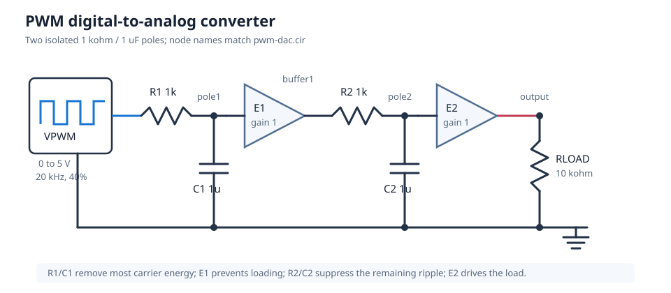
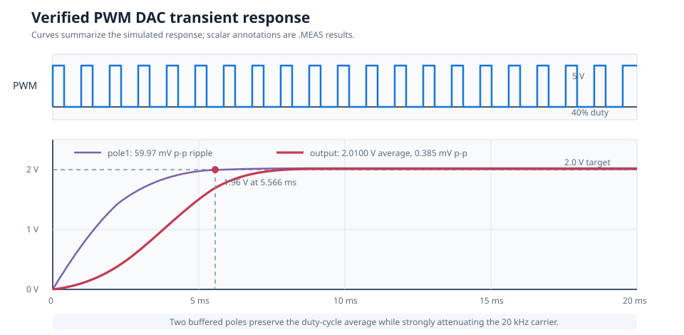

# PWM Digital-to-Analog Converter

This circuit converts a 5 V, 20 kHz pulse-width-modulated signal into an
analog voltage. A 40 percent duty cycle targets 2.0 V. Two buffered RC poles
reduce carrier ripple while keeping the design easy to calculate and adapt.

| Property | Value |
| --- | --- |
| Requires | `SpiceSharp-Parser` |
| Dialect | Portable-style SPICE |
| Analyses | TRAN |
| Difficulty | Beginner |
| Verified with | SpiceSharpParser 3.4.x repository tests |
| External cross-check | Not yet performed |

## Design Targets

| Target | Value |
| --- | ---: |
| Logic-high voltage | 5 V |
| PWM frequency | 20 kHz |
| Duty cycle | 40 percent |
| Target output | 2.0 V |
| Filter | Two buffered 1 kohm / 1 uF poles |
| Output ripple | Below 10 mV p-p |
| 98 percent settling | Below 10 ms |

## Schematic



The node names match [`pwm-dac.cir`](pwm-dac.cir). The first buffer prevents
the second pole from loading the first; the output buffer isolates the filter
from `RLOAD`.

## Runnable Netlist

The complete circuit is in [`pwm-dac.cir`](pwm-dac.cir). The signal path is:

```spice
VPWM pwm 0 PULSE(0 5 0 100n 100n 20u 50u)

R1 pwm pole1 1k
C1 pole1 0 1u IC=0
EBUFFER1 buffer1 0 pole1 0 1
R2 buffer1 pole2 1k
C2 pole2 0 1u IC=0
EOUTPUT output 0 pole2 0 1
RLOAD output 0 10k
```

The unity-gain `E` sources are intentionally simple behavioral buffers. They
let this example focus on PWM averaging and filter selection without requiring
a vendor op-amp model.

## How It Works

The first RC pole averages the PWM waveform but retains visible carrier
ripple. `EBUFFER1` reproduces that voltage without drawing current from
`pole1`. The second RC pole then attenuates the remaining 20 kHz component.
`EOUTPUT` presents the result to the 10 kohm load without changing either time
constant.

For a fixed logic-high voltage, output voltage is controlled by duty cycle.
The filter affects ripple and response speed but does not intentionally change
the settled average.

## Design Calculations

The ideal PWM average is:

$$
V_{out}=D V_{high}=0.4\cdot5=2.0\ \text{V}
$$

Each pole has:

$$
\tau=RC=1000\cdot1\ \text{uF}=1\ \text{ms}
$$

and:

$$
f_c=\frac{1}{2\pi RC}=159.15\ \text{Hz}
$$

The 20 kHz carrier is about 126 times the pole frequency. Cascading two
buffered poles therefore provides much stronger carrier rejection than a
single pole.

For two equal poles, the normalized step response is approximately:

$$
y(t)=1-(1+t/\tau)e^{-t/\tau}
$$

It reaches 98 percent after roughly 5.8 time constants. The simulated PWM
waveform reaches 1.96 V after 5.566 ms, consistent with that estimate.

## Simulation Setup

The transient runs for 20 ms with Gear integration and a 500 ns maximum
timestep. That resolves each 50 us PWM period while leaving enough time for
the two-pole filter to settle.

Measurements use the final 5 ms for averages and peak-to-peak ripple. The
settling measurement finds the first crossing of 1.96 V, which is 98 percent
of the 2.0 V target.



## Verified Measurements

| Measurement | Expected range | Verified result |
| --- | ---: | ---: |
| Output average | 1.95 to 2.05 V | 2.0100 V |
| First-pole ripple | 10 to 200 mV p-p | 59.97 mV p-p |
| Final output ripple | 0 to 10 mV p-p | 0.385 mV p-p |
| 98 percent settling time | 3 to 10 ms | 5.566 ms |

The small 10 mV difference between the ideal average and measured value is
caused primarily by the finite PWM rise and fall timing and the precise
measurement window. It remains well inside the design target.

## Real-World Applications

A filtered PWM output is useful when a microcontroller needs an inexpensive,
slow analog control voltage without a dedicated DAC. It can provide setpoints
for LED-current or motor-speed controllers, bias and calibration trims, slow
sensor excitation, or control for a voltage-controlled oscillator. The PWM
output is a command signal; it does not directly supply power to the final
load.

This example favors low ripple over fast response and is not a substitute for
a precision or full-bandwidth audio DAC. In hardware, replace the ideal
buffers with suitable op-amps, account for logic-output resistance and supply
range, and buffer any low-impedance load. Microchip's
[PWM DAC guidance](https://onlinedocs.microchip.com/oxy/GUID-15F56EF1-EBFF-405A-9412-E41CC95BAACF-en-US-2/GUID-34AC5DDB-B9AE-4272-842B-E2A1CEE69B6B.html)
explains the resolution, carrier-frequency, ripple, and filter tradeoffs.

## Experiments

- Change the PWM pulse width to 10 us or 40 us and verify the 1 V or 4 V
  output relationship.
- Remove `EBUFFER1` to see how passive loading changes the pole locations and
  DC gain.
- Reduce both capacitors to 100 nF to trade faster settling for more ripple.
- Keep the same filter and reduce the carrier frequency to show why PWM
  frequency must be well above the signal bandwidth.
- Replace `EOUTPUT` with a finite-bandwidth op-amp macromodel and inspect
  settling and output-drive limitations.

## Model Boundary

The buffers have unity closed-loop gain, infinite input impedance, zero output
impedance, unlimited current, unlimited slew rate, and unlimited bandwidth.
The PWM source also has ideal voltage levels apart from its specified 100 ns
edges.

This example is appropriate for filter sizing and system-level timing. A
hardware design must account for logic-output resistance, op-amp input/output
range, bias current, bandwidth, slew rate, supply rails, output current,
component tolerance, and load variation.

## Running and Testing

Compile and simulate it from C#:

```csharp
using System;
using SpiceSharpParser;
using SpiceSharpParser.Common;

SpiceCompilationResult result = SpiceCompiler.CompileFile("pwm-dac.cir");
if (!result.Success)
{
    throw new InvalidOperationException(
        string.Join(Environment.NewLine, result.Diagnostics));
}

foreach (var simulation in result.Model.Simulations)
{
    simulation.Execute(result.Model.Circuit);
}
```

Run its repository regression test:

```powershell
dotnet test src/SpiceSharpParser.Tests/SpiceSharpParser.Tests.csproj `
  --filter 'FullyQualifiedName~CircuitCookbookTests'
```
