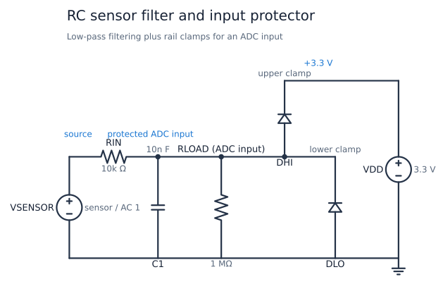
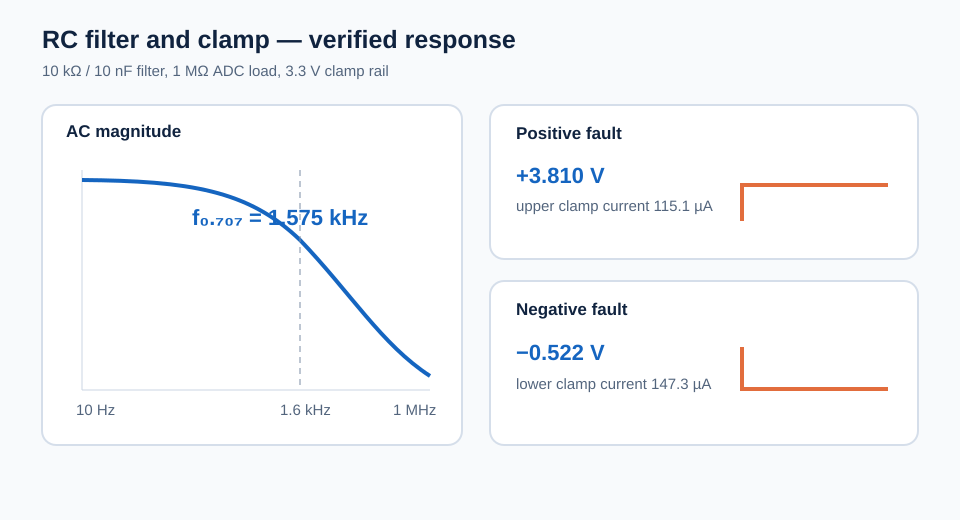

# RC Sensor Filter and Input Protector

This circuit conditions a slow sensor signal before a 3.3 V ADC input. A
first-order RC network removes high-frequency noise, while two diodes limit
positive and negative over-voltage events. The example shows why the series
resistor is part of both the filter and the protection design.

| Property | Value |
| --- | --- |
| Requires | `SpiceSharp-Parser` |
| Dialect | Portable-style SPICE |
| Analyses | AC, TRAN |
| Difficulty | Simple |
| Verified with | SpiceSharpParser 3.4.x repository tests |
| External cross-check | Not yet performed |

## Design Targets

| Target | Value |
| --- | ---: |
| ADC rail | 3.3 V |
| Nominal low-pass corner | About 1.6 kHz |
| Sensor series resistance | 10 kohm |
| ADC input load | 1 Mohm |
| Positive fault | +5 V |
| Negative fault | -2 V |
| Clamp current | Below 0.2 mA for either fault |

## Schematic



The component and node names match
[`rc-sensor-input-filter.cir`](rc-sensor-input-filter.cir). `RIN` and `C1`
form the filter. `DHI` returns positive fault current to `VDD`; `DLO` returns
negative fault current to ground. `RLOAD` represents the ADC's static input
resistance.

## Runnable Netlist

The complete circuit is in
[`rc-sensor-input-filter.cir`](rc-sensor-input-filter.cir). Its essential
network is:

```spice
RIN source filtered 10k
C1 filtered 0 10n
RLOAD filtered 0 1Meg
DHI filtered vdd DCLAMP
DLO 0 filtered DCLAMP
```

The source supplies `AC 1` for the frequency sweep and a PWL sequence for the
0 V, +5 V, and -2 V transient intervals.

## How It Works

At normal signal levels both clamp diodes are off. `RIN` and `C1` then behave
as a low-pass filter, and the high `RLOAD` value produces little DC loading.
When the input rises above the ADC rail by one diode drop, `DHI` conducts.
When it falls below ground by one diode drop, `DLO` conducts. In both cases
`RIN` limits current to a safe, measurable value.

The filter also slows a fault edge. That is usually helpful for short noise
spikes, but it means the clamp node cannot reproduce fast legitimate signals.

## Design Calculations

The loaded passband gain is approximately:

$$
A_0=\frac{1\text{ M}\Omega}{1\text{ M}\Omega+10\text{ k}\Omega}=0.9901
$$

The capacitor sees `RIN` in parallel with `RLOAD`, so:

$$
f_p=\frac{1}{2\pi(10\text{ k}\Omega\parallel1\text{ M}\Omega)(10\text{ nF})}
\approx1.61\text{ kHz}
$$

The measured absolute 0.707 crossing is 1.575 kHz because the passband starts
slightly below unity and the diode junction capacitances add a small load.
During the +5 V fault, the measured 3.810 V clamp level predicts roughly:

$$
I\approx\frac{5-3.810}{10\text{ k}\Omega}-\frac{3.810}{1\text{ M}\Omega}
=115\ \mu\text{A}
$$

## Simulation Setup

`.AC` sweeps 10 Hz to 1 MHz with a 1 V small-signal source. `.TRAN` runs for
11 ms: a positive fault begins at 1.001 ms, the input returns to zero at
4.001 ms, a negative fault begins at 6.001 ms, and the input returns to zero
at 9.001 ms. The 1 us maximum timestep resolves the 100 us nominal RC time
constant.



## Verified Measurements

| Measurement | Expected range | Verified result |
| --- | ---: | ---: |
| Gain at 100 Hz | 0.96 to 1.01 V/V | 0.9878 V/V |
| Gain at 1.6 kHz | 0.68 to 0.73 V/V | 0.7015 V/V |
| Gain at 10 kHz | 0.14 to 0.18 V/V | 0.1571 V/V |
| Absolute 0.707 crossing | 1.45 to 1.70 kHz | 1.575 kHz |
| Positive clamp voltage | 3.65 to 3.95 V | 3.810 V |
| Upper-diode current | 90 to 140 uA | 115.1 uA |
| Negative clamp voltage | -0.65 to -0.40 V | -0.522 V |
| Lower-diode current | 120 to 180 uA | 147.3 uA |
| Time of 3.5 V crossing | 1.08 to 1.18 ms | 1.122 ms |

## Real-World Applications

This is a practical starting point for slow sensor signals entering a
microcontroller or data-acquisition ADC. Examples include potentiometers,
thermistors, pressure or position sensors on a cable, current-transformer
monitoring inputs, and other externally accessible analog connectors where
high-frequency interference and occasional overvoltage can occur.

For hardware, choose `RIN` from both the required bandwidth and the ADC's
allowed injection current. Confirm that the supply rail can absorb fault
current, and check acquisition settling against the ADC's switched-capacitor
input; external Schottky diodes, a TVS, or a dedicated protection device may
be needed. Analog Devices discusses these tradeoffs in
[Protecting ADC Inputs](https://www.analog.com/en/resources/technical-articles/protecting-adc-inputs.html)
and shows a sensor-to-ADC filter and protection context in
[AN-2020](https://www.analog.com/en/resources/app-notes/an-2020.html).

## Experiments

- Increase `C1` to improve noise rejection and observe slower fault response.
- Reduce `RIN` and compare bandwidth with the higher clamp current.
- Change `RLOAD` to model a lower-impedance ADC or external bias network.
- Increase the clamp diode junction capacitance to see its high-frequency
  effect.
- Replace the 3.3 V rail with another ADC reference voltage.

## Model Boundary

The clamp model is generic and does not predict a particular MCU's injection
current rating, ESD structure, rail-lift behavior, or absolute-maximum limits.
The 3.3 V source is ideal and can absorb clamp current. A real design may need
a Schottky diode, transient suppressor, rail sink, series fuse, or dedicated
protection IC. The example omits sensor source impedance, PCB parasitics,
component tolerances, temperature, and ADC sampling kickback.

## Running and Testing

Compile the netlist with `SpiceCompiler.CompileFile(...)`, execute every
simulation in the returned model, and inspect its measurements and saved
exports. Run the cookbook gates from the repository root:

```powershell
.\tools\cookbook-schematic\.venv\Scripts\cookbook-report

dotnet test src/SpiceSharpParser.Tests/SpiceSharpParser.Tests.csproj `
  --filter 'FullyQualifiedName~CircuitCookbookTests'
```
