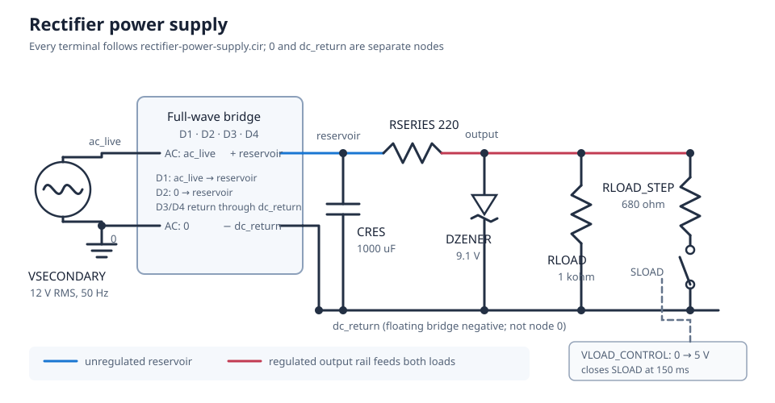
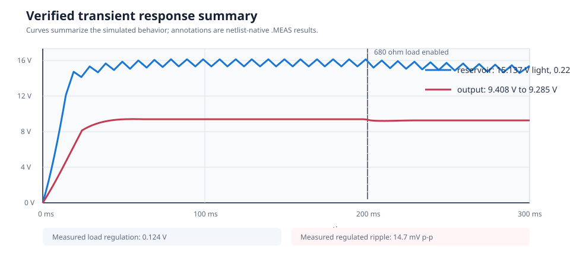

# Rectifier Power Supply

This circuit turns a 12 V RMS, 50 Hz isolated AC secondary into a filtered and
approximately 9.3 V DC output. It combines a full-wave diode bridge, reservoir
capacitor, Zener shunt regulator, and a switched load that makes load
regulation visible.

| Property | Value |
| --- | --- |
| Requires | `SpiceSharp-Parser` |
| Dialect | Portable-style SPICE |
| Analyses | TRAN |
| Difficulty | Intermediate |
| Verified with | SpiceSharpParser 3.4.x repository tests |
| External cross-check | Not yet performed |

## Design Targets

| Target | Value |
| --- | ---: |
| Transformer-secondary voltage | 12 V RMS |
| Line frequency | 50 Hz |
| Rectified ripple frequency | 100 Hz |
| Reservoir capacitance | 1000 uF |
| Nominal regulated output | About 9.1 to 9.4 V |
| Light load | 1 kohm |
| Additional switched load | 680 ohm at 150 ms |

## Schematic



Node labels in the schematic match
[`rectifier-power-supply.cir`](rectifier-power-supply.cir). `dc_return` is the
floating negative output of the bridge; all DC-side voltages are therefore
measured relative to that node.

## Runnable Netlist

The complete circuit is in
[`rectifier-power-supply.cir`](rectifier-power-supply.cir). Its main power path
is:

```spice
D1 ac_live reservoir DRECT
D2 0 reservoir DRECT
D3 dc_return ac_live DRECT
D4 dc_return 0 DRECT

CRES reservoir dc_return 1000u IC=0
RSERIES reservoir output 220
DZENER dc_return output DZ9V1
RLOAD output dc_return 1k
```

The switched 680 ohm branch closes at 150 ms. This changes the load while the
same transient simulation is running, allowing the light-load and loaded
output voltages to be compared directly.

## How It Works

On each half-cycle, two bridge diodes conduct and charge `CRES` near the AC
peak. Between peaks, the capacitor supplies the regulator and load, so the
`reservoir` voltage falls approximately linearly.

`RSERIES` limits the current entering the output node. The reverse-biased
9.1 V Zener diverts unused current to `dc_return`, while `RLOAD` and the
switched branch consume load current. When the second load is enabled, Zener
current decreases and the output droops slightly instead of following the much
larger reservoir ripple.

## Design Calculations

The peak secondary voltage is:

$$
V_{peak}=12\sqrt{2}=16.97\ \text{V}
$$

Two bridge diodes conduct at a time, so the loaded reservoir peak is lower
than 16.97 V. The simulation measures a light-load reservoir average of
15.137 V.

After the load step, the effective resistance is:

$$
R_{load}=1000\parallel680=404.8\ \Omega
$$

At the measured 9.285 V output, this is about 22.9 mA of load current. The
reservoir-ripple estimate is:

$$
\Delta V\approx\frac{I}{fC}
=\frac{26.5\ \text{mA}}{100\cdot1000\ \text{uF}}
\approx0.265\ \text{V}
$$

The simulated 0.229 V peak-to-peak ripple is close to that first-order
estimate. The difference comes from the nonlinear charging interval and the
current transferred into the Zener regulator and load.

## Simulation Setup

The 300 ms Gear transient starts with an empty reservoir capacitor. A 20 us
maximum timestep resolves the diode charging pulses. Measurements use settled
windows away from the switching instant:

- 100 to 140 ms for the light load;
- 250 to 290 ms for the parallel load;
- `.SAVE` and `.PLOT` request the AC input, reservoir, regulated output, and
  load-control signal.



## Verified Measurements

| Measurement | Expected range | Verified result |
| --- | ---: | ---: |
| Light-load reservoir average | 14 to 17 V | 15.137 V |
| Light-load output average | 8.7 to 9.5 V | 9.408 V |
| Loaded output average | 8.5 to 9.5 V | 9.285 V |
| Loaded reservoir ripple | 0.1 to 1.5 V p-p | 0.229 V p-p |
| Loaded output ripple | 0 to 0.5 V p-p | 0.0147 V p-p |
| Load regulation | -0.1 to 0.5 V | 0.124 V |

The scalar values are asserted by `CircuitCookbookTests`; the netlist-native
`.MEAS` statements remain the source of the measurements.

## Real-World Applications

This topology is useful for low-power auxiliary rails made from an already
isolated AC transformer secondary. Examples include relay or control supplies,
simple analog bias rails, educational bench supplies, and low-cost appliance
control electronics. Full-wave bridge rectifiers are also common building
blocks in home, office, and industrial AC/DC equipment.

The Zener stage is most appropriate when the load current is small and modest
regulation is acceptable. It wastes the unused current as heat, so a linear or
switching regulator is normally preferable for efficient or widely varying
loads. Never connect this example directly to mains: production hardware needs
a certified transformer and suitable fusing, insulation, clearances, surge
ratings, and thermal checks. For context, see Vishay's
[bridge-rectifier applications](https://www.vishay.com/en/product/88613/) and
Analog Devices' [diode power-supply and regulator examples](https://wiki.analog.com/university/courses/electronics/text/chapter-6).

## Experiments

- Reduce `CRES` to 220 uF and compare measured ripple with the inverse
  capacitance relationship.
- Change `RLOAD_STEP` to find the point where the Zener leaves regulation.
- Increase `RSERIES` to reduce diode and Zener current, then observe the
  load-regulation tradeoff.
- Remove `DZENER` to compare reservoir ripple directly with output ripple.
- Change the line frequency to 60 Hz and verify the expected ripple reduction.

## Model Boundary

The source represents an already-isolated transformer secondary. It does not
model mains isolation, transformer regulation, leakage inductance, winding
resistance, inrush limiting, fuses, thermal behavior, diode safe-operating
area, or Zener power rating. Component tolerances and temperature coefficients
are also absent.

Use a vendor diode/Zener model and a transformer model before making thermal,
surge-current, safety, or production decisions.

## Running and Testing

Compile and simulate it from C#:

```csharp
using System;
using SpiceSharpParser;
using SpiceSharpParser.Common;

SpiceCompilationResult result =
    SpiceCompiler.CompileFile("rectifier-power-supply.cir");

if (!result.Success)
{
    throw new InvalidOperationException(
        string.Join(Environment.NewLine, result.Diagnostics));
}

foreach (var simulation in result.Model.Simulations)
{
    simulation.Execute(result.Model.Circuit);
}
```

Run its repository regression test:

```powershell
dotnet test src/SpiceSharpParser.Tests/SpiceSharpParser.Tests.csproj `
  --filter 'FullyQualifiedName~CircuitCookbookTests'
```
