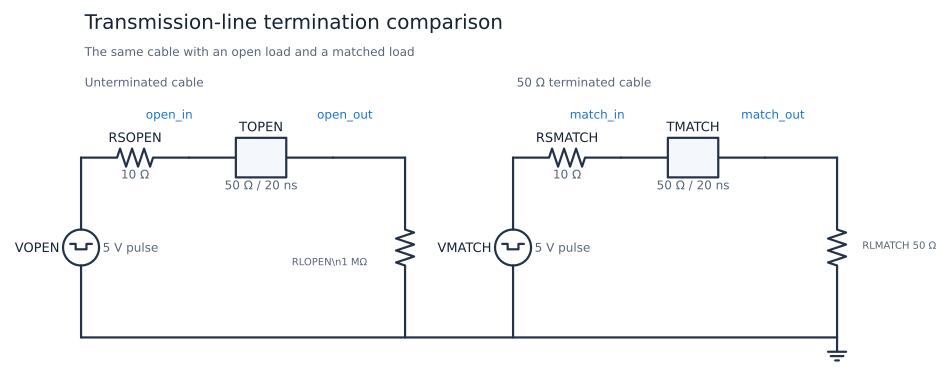
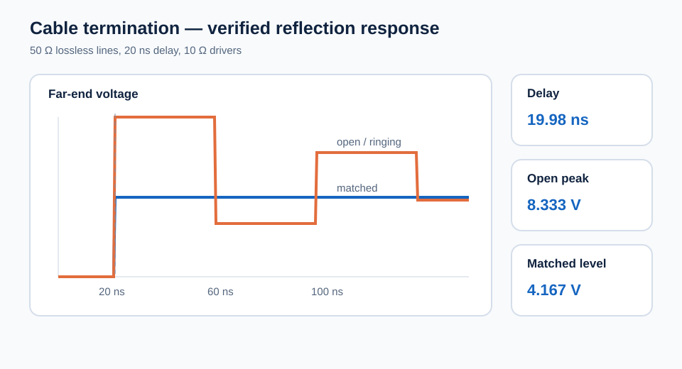

# Transmission-Line Termination and Cable Driver

This circuit compares the same fast pulse driver and 50 ohm, 20 ns lossless
cable with two loads: a nearly open input and a matched 50 ohm termination.
It shows propagation delay, launched-wave amplitude, load reflection, source
reflection, ringing, and the clean response obtained by impedance matching.

| Property | Value |
| --- | --- |
| Requires | `SpiceSharp-Parser` |
| Dialect | Portable-style SPICE |
| Analyses | TRAN |
| Difficulty | Difficult |
| Verified with | SpiceSharpParser 3.4.x repository tests |
| External cross-check | Not yet performed |

## Design Targets

| Target | Value |
| --- | ---: |
| Driver step | 0 to 5 V in 1 ns |
| Source resistance | 10 ohm |
| Cable impedance | 50 ohm |
| One-way delay | 20 ns |
| Open-load approximation | 1 Mohm |
| Matched load | 50 ohm |
| Transient timestep | At most 0.25 ns |

## Schematic



The names match
[`transmission-line-termination.cir`](transmission-line-termination.cir).
`TOPEN` and `TMATCH` are identical lossless lines. Only `RLOPEN` and
`RLMATCH` differ, so the waveforms isolate the effect of load termination.

## Runnable Netlist

The complete circuit is in
[`transmission-line-termination.cir`](transmission-line-termination.cir). The
two line definitions are:

```spice
RSOPEN source_open open_in 10
TOPEN open_in 0 open_out 0 Z0=50 TD=20n
RLOPEN open_out 0 1Meg

RSMATCH source_match match_in 10
TMATCH match_in 0 match_out 0 Z0=50 TD=20n
RLMATCH match_out 0 50
```

## How It Works

Before any reflection returns, the source sees the line's 50 ohm
characteristic impedance. The 10 ohm source resistance and line form a divider
that launches 4.167 V. The wave reaches the far end 20 ns later.

The matched load absorbs the incident energy because its reflection
coefficient is zero. The 1 Mohm load has a reflection coefficient very close
to +1, so voltage at the open end nearly doubles to 8.33 V. That reflected
wave reaches the source after another 20 ns, sees a negative source reflection
coefficient, and begins a sequence of alternating corrections.

## Design Calculations

The launched voltage is:

$$
V^+=5\frac{50}{10+50}=4.1667\text{ V}
$$

The load reflection coefficient is:

$$
\Gamma_L=\frac{R_L-Z_0}{R_L+Z_0}
$$

For 50 ohm, `Gamma` is zero. For 1 Mohm it is 0.9999, producing an initial
far-end voltage of approximately `V+ (1 + Gamma) = 8.33 V`. The source
reflection coefficient is `(10 - 50) / (10 + 50) = -0.667`, explaining the
subsequent alternating corrections.

## Simulation Setup

Both pulse sources rise at 5 ns with a 1 ns edge and remain high for 150 ns.
The Gear transient runs to 200 ns with a 0.25 ns maximum timestep, one eightieth
of the line delay. Measurements capture propagation delay, the first open-load
peak, a later ringing interval, the matched level and peak, and the source-end
voltage before and after the first round-trip echo.



## Verified Measurements

| Measurement | Expected range | Verified result |
| --- | ---: | ---: |
| One-way propagation delay | 19.5 to 20.5 ns | 19.98 ns |
| Unterminated first peak | 8.0 to 8.6 V | 8.333 V |
| Unterminated late average | 6.2 to 6.8 V | 6.481 V |
| Matched load level | 4.0 to 4.3 V | 4.167 V |
| Matched load peak | 4.0 to 4.3 V | 4.167 V |
| Source end before echo | 4.0 to 4.3 V | 4.167 V |
| Source end after echo | 5.3 to 5.8 V | 5.555 V |

## Real-World Applications

Use this circuit when a fast edge must cross an interconnect whose propagation
delay is no longer negligible compared with the edge time. Typical examples
include 50 ohm coax between laboratory instruments, clock or data traces from
an FPGA to an ADC, and controlled-impedance links across a PCB or backplane.
The same reflection and matching principles also apply to differential cables,
although their impedance and termination network are different.

The matched branch demonstrates receiver-end parallel termination: it gives a
clean first arrival, but continuously loads the driver. A hardware design must
use the measured trace or cable impedance, include the driver's actual output
resistance, and verify receiver overshoot and undershoot limits. See TI's
[High-Speed Layout Guidelines](https://www.ti.com/lit/an/scaa082a/scaa082a.pdf)
for practical termination choices and examples of incorrect-termination
reflections.

## Experiments

- Change `RLMATCH` to 25 ohm and observe the negative load reflection.
- Change both source resistors to 50 ohm and compare source re-reflection.
- Double `TD` and confirm that every reflection event moves by the delay.
- Slow the input edge until it is long compared with the cable delay.
- Replace the ideal line with a lumped ladder and compare approximation error.

## Model Boundary

The lossless line has no conductor resistance, dielectric loss, dispersion,
frequency-dependent impedance, common-mode behavior, crosstalk, connector
discontinuity, or radiation. The 1 Mohm branch is an open-circuit
approximation. Driver output impedance is a fixed resistor and the loads are
purely resistive. Real cable analysis must include edge-rate-dependent losses,
package and connector parasitics, return-path geometry, and receiver limits.

## Running and Testing

Compile with `SpiceCompiler.CompileFile(...)`, execute the transient, and
inspect the measured and saved near-end and far-end voltages. Run:

```powershell
.\tools\cookbook-schematic\.venv\Scripts\cookbook-report

dotnet test src/SpiceSharpParser.Tests/SpiceSharpParser.Tests.csproj `
  --filter 'FullyQualifiedName~CircuitCookbookTests'
```
